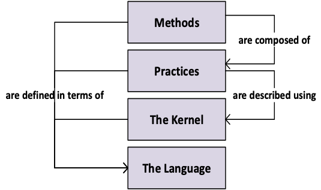

DevOps QMS Draft 2020-09-15

Secure and Agile Connected Things

# D2.1 - IoT platform Public Intermediate

Till S. Witt (NXP Semiconductors Germany GmbH), till.witt@nxp.com

Arne Ehrlich (consider it GmbH), ehrlich@consider-it.de

Franklin Selgert (AnyWi), franklin.selgert@anywi.com

2020-09-15

DE/NL

ITEA3, 17005

BMBF, 01IS18062(A-E)

**Abstract**

Development and operation of secure, large-scale IoT systems is hard. While there exist Software Development Environments (SDE), platforms aimed at providing tools and methods to control software development, testing and integration, they do not solve the major concerns of today&#39;s software-intensive systems: security, agility and a need for fast deployment of IoT system updates. Tooling is just one element of a SDE evenly important are the processes that control the workflow of all developer involved. Processes that include the necessary security steps. SDE&#39;s are one part of the puzzle companies apply different methods to guide their IoT development. This mix of methods, practices and tools do not have a common standard or way of working\*(ref method wars Jacobson).

The main challenge in the SCRATCh project is to describe a method, way of working that improves the overall security of IoT systems, without inventing yet another method or way of working. Our approach on this is to use available practice and methods, abstract commonalities and describe what specific actions and tooling could contribute to more security awareness in IoT development.

In this paper the DevOps cycle is used as a common workflow process and combined with elements from the Essence method SDE of the OMG group, with the intention to inject actions, tools way of work into any structured software development process with a specific attention to security.

Note:

SCRATCh in its entirety is a complex project as it is both a research and explorative type of project. In its description and timelines it follows a waterfall type of process: requirements, development, validation of tools and secure methods of working. The tough practice is different a iterative process not in line with set deliverables and timelines. Learning on route getting a grip on a method and projecting this back into the requirements and tool development.

1.
# Contents

[1. Contents 2](#_Toc64380514)

[2. Introduction 3](#_Toc64380515)

[3.The 3C Method explained 4](#_Toc64380516)

[Crash course of the Essence method 4](#_Toc64380517)

[4.CONSTRAIN the first C of the method 5](#_Toc64380518)

[Tools 7](#_Toc64380519)

[5.COMPLY the second C of the Method 8](#_Toc64380520)

[Tools 9](#_Toc64380521)

[6.CONTROL the third C of the Method 10](#_Toc64380522)

[Tools 11](#_Toc64380523)

[7.Conclusion 11](#_Toc64380524)

[8.References 12](#_Toc64380525)

1.
# Introduction

W  hat is a method? According to the Cambridge dictionary &quot;a [particular](https://dictionary.cambridge.org/dictionary/english/particular) way of doing something&quot;. This covers almost anything including throwing a dice to decide on the most important security requirement. That also explains the multitude of available methods a comparison of methods for IoT development is given in [CITATION Merzouk2020 \l 1043]. Each method tends to have its own focus point, e.g. Xtreme programming focus on writing &quot;good&quot; code, DevOps, focuses on the relation between operation and development. SecDevOps focuses on the relation between Security development and operation. Most of DevOps discussions are about continuous integration and delivery. Less attention is paid to the plan Phase of DevOps. In SCRATCh we identified the Plan Phase as an important step to improve on security. In search for a method to apply within the context of SCRATCh we took the generic method the Essence, Kernel and language for software engineering methods [CITATION OMG18 \l 1043]. Figure 1 shows its approach the Essence method is composed of practices adding two elements to this model a Kernel existing of standard practice elements and a common language to describe those, a metamodel is constructed that could be used to describe most methods in a common language. [CITATION IvarJacobson2018 \l 1043]. Assuming most development processes have a similar structure, taking the Essence model as a start and describe the attention points that SCRATCh found as important to improve on the security standpoint of IoT system, led to the 3C method of SCRATCh, not a new method but more a clarification, addition to two existing ones; DevOps and Essence.

Figure 1 Method architecture Essence

1.
# The SCRATCH 3C Method explained

**In this chapter we will explain the 3C method using the Essence method and the DevOps process. The assumption is that the reader has some knowledge of DevOps and a generic understanding of software development.**

## Crash course of the Essence method

The main concept in the essence theory is the existence of a Kernel that is common to all software development methods, the main element in this Kernel is what is called Alpha&#39;s (Abstract Level Progress Health Attribute) a complicated name that captures the versatile nature of an Alpha, depending on the area of concern that it belongs to.

Figure 2 Essence Method

The essence method, has three main concepts:

1. Things to work with, these are called Alpha&#39;s . Alphas undergo states e.g. for the Work alpha this is initiates-prepared-started-under control-concluded-closed. Each alpha has its own state transitions.
2. Things to Do, activities that combines certain states of Alphas as input to realize a state transition of one or more Alpha&#39;s, as an example see Figure 6: Essence Method things to do Test the System.
3. Competencies, relates to the skills needed to fulfil the task of state transitions. This concept relates with the DevOps philosophy that certain competencies need to be combined in one team.

The essence method organizes alphas in areas of concern, concepts that are common to any development cycle, a **customer** with needs, a **solution** to comply with those needs and an **Endeavour** to manage and organize the work that creates the Solution. Security is not a separate competence nor an integrated item in one of the Alpha&#39;s it is inherently addressed in the Alpha &quot;Requirements&quot;. The paper [CITATION Syynimaa.2018 \l 1043] gives an overview and explanation of the Essence standard.

1.
# CONSTRAIN the first C of the method

**In SCRATCh we identified the Plan phase of DevOps or the design Phase of a Software development process as the starting point for Security.**

As a proven concept: &quot;cost changing a product are lowest in the design phase&quot;, this also applies to security related adaptations of a product, page 18 [CITATION Fra14 \l 1043]. Security in most models is an attention point across all phases, items. In case of Essence this would span the areas of concern of customer, solution, endeavor. (Figure 3: Security and areas of concern)

**Areas of concern SCRATCh, DevOps and Essence**

Figure 3: Security and areas of concern

Although true it does not provide much guidance. The DevOps viewpoint, with a focus on process, would be: involve the security discipline in the process at start. From the customer perspective it could mean: a security minded customer or stakeholder to guard the security aspect.

The target is that a solution should be as secure as possible, or needed. In most cases, in any method, the development of a solution is guided by: stakeholder needs, requirements etc.

Getting security on top from the start the goal should be getting security as an inherent property of stakeholder needs or requirements. In SecDevOps it would mean that in the Plan Phase a Security requirement from a standards or best practices is inserted as design-constrain. in the SCRATCh whitepaper [CITATION Selgert2020 \l 1043] one constrains is identified as no 1 important type of DevOps constrain, the capability to update the IoT device securely, keeping the system safe. In all mayor standards like ETSI, ENISA, OWASP IoTSF requirements (are mentioned taking this seriously. In the Essence method **Constrains** are part of the Kernel Alphas, _Restrictions, policies, or regulatory requirements_ the team must comply with see Figure 4: constrains as security requirement

Figure 4: constrains as security requirement

Conclusion: SCRATCh proposes &quot;constrains&quot; or essential security requirements that act as a design-constrain to be injected in the plan Phase or be part of the requirements before starting the development process.

**HOW TO implement the constrains.** The first C, constrain means that a set of security needs should be available matching the type of development at hand, and matching the granularity of the stakeholders need. Choosing the best practices/ regulations to start the development is time consuming and depends on the sector where the IoT device/software is supposed to function. The SCRATCh knowledge base provides several starting points.

1. [https://trusttab.com/req\_tool/dcms\_code](https://trusttab.com/req_tool/dcms_code), 13 high level security requirements that are mapped to 47 regulatory, standards and industry consortia.
2. [https://trusttab.com/req\_tool/owasp\_top10](https://trusttab.com/req_tool/owasp_top10) , 10 high-level security requirements and related with these [https://trusttab.com/req\_tool/owasp\_isvs\_1\_0rc](https://trusttab.com/req_tool/owasp_isvs_1_0rc) 125 test requirements.
3. [https://trusttab.com/req\_tool/enisa\_req](https://trusttab.com/req_tool/enisa_req) ENISA baseline security recommendations.
4. Policies

Example: if Security from a stakeholder requires a basic security like CIA: Confidentiality, Integrity, Authentication, searching on these keywords in ENISA best Practices gives a starting list of the following constrains:

Tabel 1: ENISA, authentication constrains

| **Description** |
| --- |
| Ensure password recovery or reset mechanism is robust and does not supply an attacker with information indicating a valid account. The same applies to key update and recovery mechanisms. |
| --- |
| Protect against &#39;brute force&#39; and/or other abusive login attempts. This protection should also consider keys stored in devices. |
| Authentication credentials including but not limited to user passwords shall be salted, hashed and/or encrypted. |
| Authentication mechanisms must use strong passwords or personal identification numbers (PINs), and should consider using two-factor authentication (2FA) or multi-factor authentication (MFA) like Smartphones, Biometrics, etc., and certificates. |
| Ensure default passwords and even default usernames are changed during the initial setup, and that weak, null or blank passwords are not allowed. |
| Design the authentication and authorization schemes (unique per device) based on the system-level threat models. |

Tabel 2: ENISA, software and firmware update constrains

| **Description** |
 |
 |
| --- | --- | --- |
| For control systems which cannot be updated (e.g. legacy systems), apply compensating measures, such as network segmentation, micro segmentation, system relocation or additional real-time monitoring tools. Perform risk analysis to determine if it is possible and sufficient to improve security of existing system or if the replacement of the system is necessary. |
 |
 |
| Allow Third Parties to perform patching only if they guarantee and are able to prove that the patch has been tested and will not have any negative consequences on the device or if the Third Party assumes the liability for the update according to an applicable agreement. In addition, require Third Parties to report any executed actions related to the patching process and inform about them in advance. Update procedures shall be documented, known and controlled by the organization. |
 |
 |
| Perform deployment of patches for the IoT devices only after proving that no negative consequences exist. Test the patches in a test environment before implementing them in production. If this is not possible, begin with deploying patches only on a segment of a system, ensuring that other zones will continue to operate normally in case a patch exerts any negative impact on a chosen segment. |
 |
 |
| Execute automatic update procedures only if they are based on the risk analysis and if the devices for which the automatic update can be allowed are identified. Verify the source of the update. |
 |
 |
| Verify endpoints&#39; software/firmware authenticity and integrity and ensure tight control over the update. Signing code updates (to be able to authenticate the code before it is loaded) and maintaining the authenticity is advisable. |
 |
 |
|
 |
 |
 |
| --- | --- | --- |

## Tools

Having identified **firmware and software update** as important, a Tool is developed in SCRATCh to provide a method to perform updates securely. A tool that is used in the Deployment Phase of DevOps. This tool however casts constrain back to this phase of the development, if a component of an IoT system does not have an update capability there is no way to perform it securely or insecurely.

And in case a component is lacking the update capability for whatever reason another counter measure must be designed as pointed out in ENISA best practice:

_For control systems which cannot be updated (e.g. legacy systems), apply compensating measures, such as network segmentation, micro segmentation, system relocation or additional real-time monitoring tools._

Project Learnings:

During the development of the tools and maturing the use-cases and use of the tools, the project team identified a minimum set of essential security requirements that can be helpful as a low effort start for any IoT development to reach a minimum level of security.

_(findings come here)_

1.
# COMPLY the second C of the Method

The second C Comply refers to testing, a mayor part of the effort for creating a new system. The assumption is that the constrains contain also the essential security related requirements then testing has to proof compliance with them as is with all the other requirements. Testing itself is a complex activity and occurs at different moments of the development (ref whitepaper SoTA).

From a DevOps perspective Comply covers the code, Build, Test and Release Phase

From DevOps perspective see Figure 5; Testing cycles in DevOps, it is clear that there are multiple methods for testing a system. From Code testing to load testing. Testing of the essential security constrains is done in the complete testing chain depending on the type of requirement.

Figure 5; Testing cycles in DevOps

As an example, the requirement from ENISA: _Verify endpoints&#39; software/firmware authenticity and integrity and ensure tight control over the update. Signing code updates (to be able to authenticate the code before it is loaded) and maintaining the authenticity is advisable_. this can only be tested in a ready system at point of loading new firmware in DevOps &quot;Load testing&quot; in IoT system this means an identical copy of parts of the life system is needed or the test is conducted in the life system. Mirroring a IoT environment is a real identified bottleneck for end system testing. Potential solutions for this might be a digital twin system emulation, a software copy of a hardware system currently these solutions are not yet available.

A second example of a security requirement from ENISA: _Authentication credentials including but not limited to user passwords shall be salted, hashed and/or encrypted._ Can be tested at code level and/or at unit integration.

A third example reflected in OWASP ISVS:_Verify that compilers, version control clients, development utilities, and software development kits are analyzed and monitored for tampering, trojans, or malicious code_. Is a requirement that is on a more process level for software development. It requires to check for known threats/vulnerabilities in the libraries and tools used to create the system.

The essence method Figure 6: Essence Method things to do Test the System, indicates the same process as with DevOps although its presentation is different and more abstract. The essence method also sees testing as verifying the compliance to requirements. However, the different stages of testing are spread out over different states of the system and its requirements. The activity Test the System is equivalent to functional testing, user acceptance testing and load testing.

Figure 6: Essence Method things to do Test the System

Other testing is done in an activity labelled implement the system where bug fixing and unit testing can be positioned. There is no specific mentioning of the check for known threats/vulnerabilities in the libraries and tools used to create the system. In Essence terms this would be handled by the item Way of Working as it is a more process related requirement.

Conclusion, this step of the 3C method Comply is well covered in existing methods, the emphasis is on testting essential security requirements.

## Tools

For this step there are multiple tools commercially available (see D1.2 SCRATCH), In SCRATCh we developed a few specific tools for testing:

Verification testing Tools (Nviso)…..

Penetration Testing tool (Nviso)……

Unit testing (Ulma)

Project Learnings:

During testing in the different use cases the tools used and the identified a minimum set of essential security requirements led to the following findings?

### _(findings come here)_

1.
# CONTROL the third C of the Method

Controlling a system is all about keeping it safe, the level of control possible depends on what part of a collection of essential security requirements is implemented in the system and what part of the security policies are embedded in the support organisation. This is the last C of the proposed 3C method but actually the most important one as it is to be expected that any system will fail one time during its lifecycle, as explained in Cynefin Framework, DevOps and Secure IoT[CITATION Selgert2020 \l 1043]. In the 3C method Control includes the deployment step of essence and DevOps, as this step is about the control over updates to the system.

From a DevOps perspective Control covers the deploy, operate and monitor Phase

DevOps is, amongst other things, about shifting operational knowledge to the design Phase e.g. by stating certain requirements important to maintain a system, SecDevOps is about security involvement from start to finish e.g. by inserting essential security related requirements in the design phase (the first C)

The Essence Method is less explicit about this Phase and so is the DevOps method, Operation is the part where methodology explicitly enters the domain of a specific implementation, and where a complete new area of knowledge is introduces e.g. ITIL. Operation tends to be more process or policy focused and tailored towards the capabilities of the company that maintains a system. The inclusion of &quot;constrains&quot; to make a level of control possible is laid out by the first 2 C&#39;s and is in essence covered by both methods DevOps and Essence see (Figure 7: Essence Things to Do, Operate the System)

Figure 7: Essence Things to Do, Operate the System

Getting new essential security requirements as feedback from the operations phase is explicitly covered by the DevOps process approach. What is missing is an active feedback, on an organisational level, of constrains posed by the restrictions of a specific organisation maintaining a solution. For this issue there is not a clear solution, but a recommendation is available in the form of the policy best practices by ENISA.

_E.G ENISA: Clearly define all relevant aspects of the partnership with Third Parties, including security, within the appropriate agreements and contracts (e.g. SLA - service level agreement, NDA - Non-Disclosure Agreements). Sign these agreements and contracts before the start of cooperation._

_Establish and maintain asset management procedures and configuration controls for key network and information systems._

There are more requirements, but it is clear that these requirements should translate to features in the System. Asset Management could need a strict and secure identification method of devices, Partnership type of relations could mean a segmented authorisation method to the system.

As part of Control also the DevOps Step deployment is considered,

## Tools

For this Part several tools have been developed in SCRATCh:

Secure deployment tools: …

Deception toolkit

…..

Project Learnings:

During the operational Phase or Control part of a system tools and use in use-cases the project team identified a minimum set of tools to effectively control/ maintain a IoT system and keeping it safe

_(findings come here)_

1.
# Conclusion

Getting to Secure DevOps for SME&#39;s is about Awareness, Process and activities. To get to this point: Three main aspects can be identified to contribute to more secure products\* Constraints, Comply, Control. Aspects that are mainstream in the last 5 decades of software development in different wording and in different methods. (see fig 8 for an overview of 3C, Essence and DevOps method)

In the essence model the wording constrains are related to requirements. Comply is the activity to construct a (software) system that fulfils these requirements. Control is and activity related to the Use of the (software) system. In more detail the essence model works with transition of states of an object called an alpha and things to do performed by the work alpha guides by a certain way of working, to progress from one state to another. Certain combination of states for the alphas e.g.

The 3C method is a rough simplification using both models and is focused on security, to serve Scratch&#39;s intent to guide SME&#39;s toward more Secure IoT system development. Simplifying the complex nature of both DevOps and Software development, to implement basic security with a minimal effort. This 3C method is supported by the mentioned tooling developed in the SCRATCH project.

Open Points:

At this time in the project not all tools are developed or ready.

On the list to be completed are:

Knowledge base optimization for quick determination of relevant essential security constrains.

Basic template structure to apply the 3C method.

Unit testing tool.

Conclusion of all the findings

1.
# Apendix 1

Figure 8 overview states of main Alpha&#39;s[CITATION OMG18 \l 1043], DevOps and 3C methodology

Figure 8 illustrates the relation between the different states of the alpha&#39;s stakeholders, Opportunity, requirements and system. Whereas&#39;s requirements are split in high-level, external and detailed requirements. The representation reflects the the influence of the V-model for system engineering.

1.
# References

Fraunhofer. (2014). _Development of Secure Software with Security by Design._ Darmstadt: Fraunhofer.

Jacobson, I., &amp; Stimson, R. (2018). Tear down the Method Prisons! _Software development_.

Merzouk, S., Cherkaoui, A., Marzak, A., &amp; Nawal, S. (2020). IoT methodologies: comparative study. _Procedia Computer Science, 175_, 585-590. doi:https://doi.org/10.1016/j.procs.2020.07.084

OMG. (2018). _OMG (2018). Essence - Kernel and Language for Software v 1.2._ OMG.

Selgert, F. (2020, 9). Cynefin Framework, DevOps and Secure IoT: Understanding the Nature of IoT Systems and Exploring Where in the DevOps Cycle Easy Gains Can Be Made to Increase Their Security. _Cynefin Framework, DevOps and Secure IoT_ (pp. 255-265). Springer. doi:10.1007/978-3-030-55583-2\_19

Syynimaa., N. (2018). Essence: Reference Architecture for Software Engineering - Representing Essence in Archimate Notation. _Proceedings of the 20th International Conference on Enterprise Information Systems - Volume 2: ICEIS,_ (pp. 345-350). SciTePress. doi:10.5220/0006793603450350

##

Copyright © 2018-2022, SCRATCh 13
